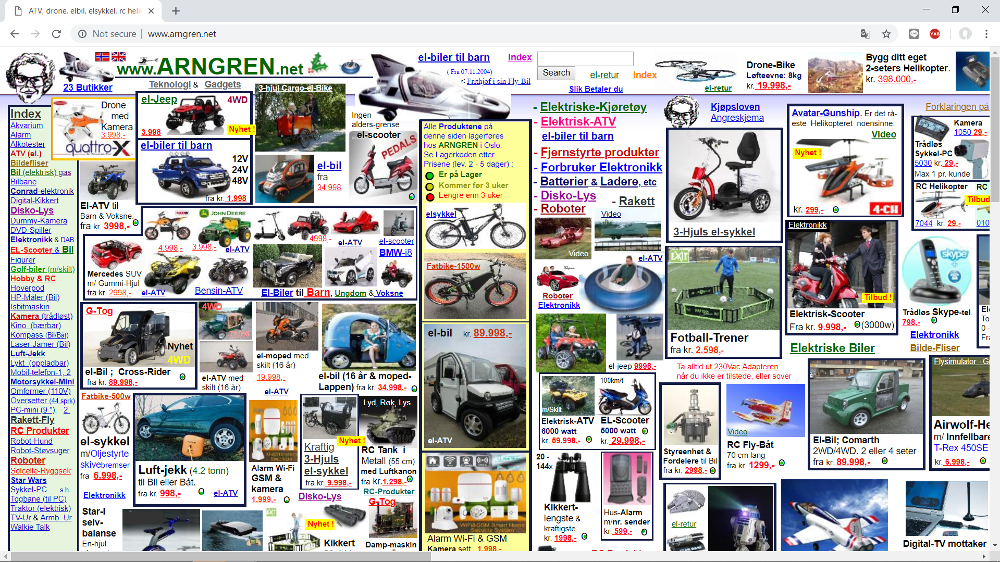
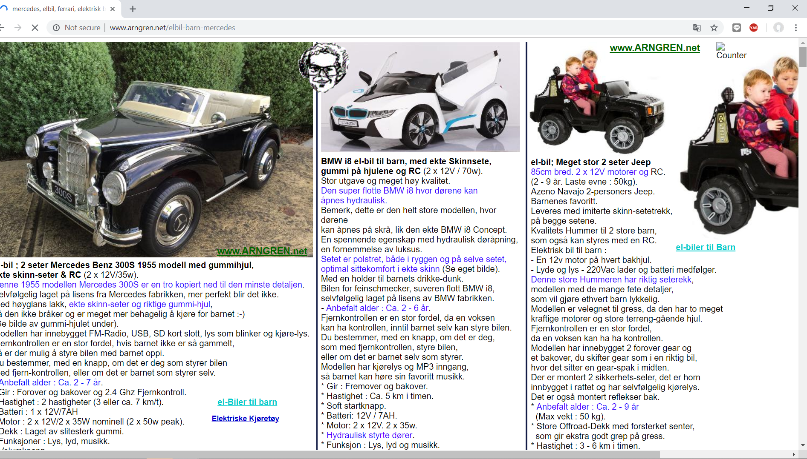
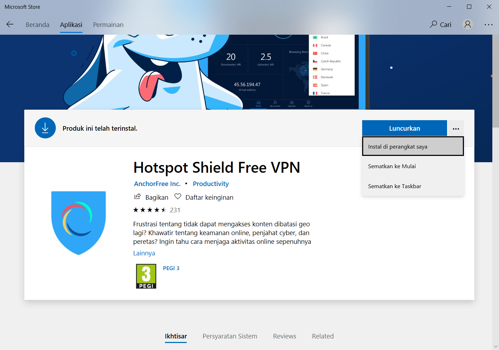

# HCI Home Work

Elvega Dewangga Rachmatullah
05111640000149
IMK A

---

##  List of Bad UI websites

1. [Arngreen](http://ie-games.iefairits.com)
  * [Review Video](https://youtu.be/fY1lgc5YwlY)
1. Windows store
1. Motorcycle
---

### Arngreen
Arngreen is an use item advertisment website . From just the main page i can said its realy confusing the people who visits that website :tw-1f605:

    

there are so much item on a singgle page with untidy arrangement . and there are also an unpolite advertisement without age restriction and agreement frist

    
when i click on an advertisement to see the detail product . i became even more confused :tw-1f629: there are a lot of advertisement inside and even its an e-commerce website even though its hard to find how could i buy this item

**solution**
1. for the solution i think they must arrange the item so we could easily find how to buy that item and than please remove unpolite advertisement
2. on a detail product they should make one page for one advertisement

---

### Windows Store
Windows store is an aplication from microsoft for user to install aplication/game with free or paid
    
at frist we could see the aplication is good the arrangement is tidy and its easy for user to install it.

    
But when im already install the aplication i found some button missing :tw-1f631: :tw-1f631:

Yeaah its delete button , im already search it for a while then end up by searching at google about how to delete the application . then i find out that there are no delete button we must open app and feature on windows to delete it

**solution**
1. add some delete button like googleplay has
---
### Motorcycle

Lets see :tw-1f60f:

At frist that motor cycle look good and look cool for  motorcycle
    
But when you see for the secure its too bad :tw-1f631:
Look at this
    
THERE IS NO KEY!! how if someone knows this motorcycle is keyless . some bad people will try to steal this

**solution**
1. add some key
"# assignment-0-EDewangga" 
